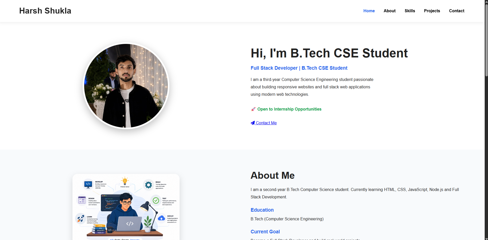

# 🌐 Full Stack Portfolio Website

A modern Full Stack Portfolio Website built using **Node.js, Express.js, MongoDB Atlas, HTML, CSS and JavaScript**. The portfolio showcases my skills, projects, and provides a fully functional contact form with database storage and email notifications.

## 🚀 Live Demo

🔗 https://portfolio-website-jszk.onrender.com

## 📸 Preview



---

## ✨ Features

- 👨‍💻 Responsive Portfolio Website
- 📱 Mobile Friendly Design
- 📬 Contact Form
- 💾 MongoDB Atlas Integration
- 📧 Email Notifications using Nodemailer
- ✅ Form Validation
- 🎉 SweetAlert2 Popups
- 📄 Resume Download
- 🔒 Environment Variables (.env)
- ☁️ Deployed on Render

---

## 🛠 Tech Stack

### Frontend
- HTML5
- CSS3
- JavaScript

### Backend
- Node.js
- Express.js

### Database
- MongoDB Atlas
- Mongoose

### Tools
- Git
- GitHub
- Render
- Nodemailer

---

## 📂 Project Structure

```
portfolio-website/
│
├── images/
├── index.html
├── style.css
├── script.js
├── server.js
├── package.json
├── resume.pdf
├── .gitignore
└── README.md
```

---

## ⚙ Installation

Clone the repository

```bash
git clone https://github.com/harshitshukla8218-cell/portfolio-website.git
```

Go to project directory

```bash
cd portfolio-website
```

Install dependencies

```bash
npm install
```

Create a `.env` file

```env
MONGO_URI=your_mongodb_connection_string
EMAIL_USER=your_email@gmail.com
EMAIL_PASS=your_app_password
```

Run the project

```bash
node server.js
```

Visit

```
http://localhost:3000
```

---

## 📬 Contact

**Harsh Shukla**

📧 Email: harshitshukla8218@gmail.com

🔗 LinkedIn:
https://www.linkedin.com/in/harsh-shukla-214196364

💻 GitHub:
https://github.com/harshitshukla8218-cell

---

## ⭐ Future Improvements

- Dark Mode
- Project Filtering
- Blog Section
- Admin Dashboard
- Visitor Counter
- Better Animations

---

## 📄 License

This project is licensed under the MIT License.

---

⭐ If you like this project, don't forget to star this repository.